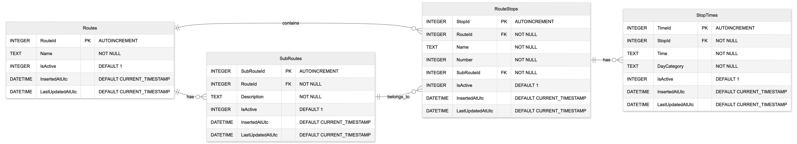

## Where to find everything…

### main architectural layers
 - `src/Timetables.Domain` - pretty thin, just some DTOs for stops and related entities
 - `src/Timetables.Application` - application logic organized by use case. Also defines interfaces required by the application layer.
 - `src/Timetables.Infrastructure` - implementation of infrastructure concerns to satisfy interfaces defined by the application layer, database initialization code.
 - `src/Timetables.Presentation` - controllers, app configuration, and startup.

 Dependencies go in order: presentation -> infrastructure -> application -> domain. Each layer can depend on any layer beneath it, and no layer can depend on a layer above it.

### other stuff
- `data/*` - the sqlite database file, initialization script, and an ERD of the database design

- `tests/Application.Tests` - unit tests that don't touch infrastructure
- `tests/Integration.Tests` - tests that initialize a test database before the first test and tear it down after the last test

## domain concepts
The `Stop` is the core entity in this implementation. Although it's implicit throughout the design, I found I didn't need an explicit route object in a world where we start by getting all the stops for a known route. I started out having one but found it made the design simpler to think in terms of “get me all the stops for route x“ rather than “get me route x and all of its stops“.

I wanted to support the concept of northbound and southbound legs of the route without making them separate routes or conceptually tying them to the directions “north” and “south”. This is represented by the concept of the subroute and is surfaced by `Stop.Subroute`. Again I found that subroute didn't need to be its own entity. I still wanted to query in terms of “give me the stops for route x“ and let higher level business logic or UX determine how to group stops by subroute.

I decided to have each stop own its stop times throughout the day, so stop times conceptually belong to a stop. However, I also wanted to support the concept of different schedules for weekdays and weekends, so rather than a stop owning a collection of times directly, it owns a collection of schedules. A schedule consists of a designated `DayCategory` (weekday or weekend) and a collection of times implemented using the `TimeOnly` type. I figure this could be expanded to accommodate holiday schedules, closures, etc. This allows higher level business logic to determine which schedule to surface based on the current date and time.

A more literal approach would have been to have routes contain subroutes, and each subroute contain a collection of  schedules, with the stops and times repeated per schedule, but I felt like this would be harder to work with and interfere with the simplicity of getting all stops for a route and letting business logic work on the result.

## use case details

`UseCases/GetStops` fetches and returns the stops for a given route (always F in this case).

`UseCases/NextScheduledTime` takes in a stop number, fetches the schedules for that stop, and then performs the business logic to identify the time of the next arriving bus:
- gets the applicable time zone from injected settings
- accounts for weekday vs weekend schedules based on current time/date
- rolls to the earliest stop on the following day if no more buses on the current day
- if no buses for the current day or the following two days, will return unavailable

The logic to resolve the next scheduled time is isolated in `NextStopTimeResolver`, which has no dependencies and makes testing the bulk of the application logic easy.

## infrastructure details
`StopsRepository` takes in a simple connection string factory and manages connection lifecycle per operation. It uses Dapper to map results to DTOs corresponding to row data, and explicit mapping to map row data objects to domain objects that are returned in the query result. Connection management and querying could be abstracted into other components consumed by repositories, but given the current level of application simplicity, I prefer being able to see everything that is going on right in the repository implementation.

## database

To be strictly normalized `RouteStops` would be a child table of `Subroutes` and not share a relationship with `Routes`, but I decided to add `Subroutes` after the relationship between `Routes` and `RouteStops` was already established, and I liked the idea of being able to see the parent route right on the route stop. This is all abstracted away in the way the tables are queried but I felt like this made it easier to think about.

I also considered having an explicit table and foreign key for `DayCategory` on `StopTime` but decided the scope of day category was sufficiently limited to control data integrity from the application. In a more complex system of differing schedules for differing days this would likely change.